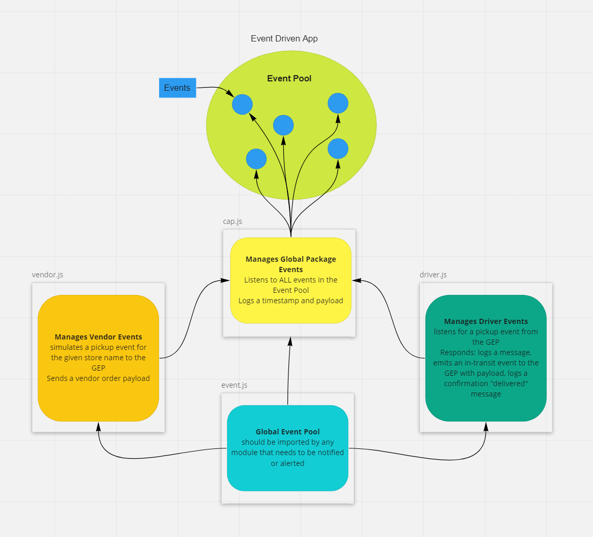

# Lab: Event Driven Applications

## APS Phase 1

- Begin the build of an application for a product called CAPS - The Code Academy Parcel Service. In this sprint, we’ll build out a system that emulates a real world supply chain. CAPS will simulate a delivery service where vendors (such a flower shops) will ship products using our delivery service and when our drivers deliver them, each vendor will be notified that their customers received what they purchased.

This will be an event driven application that “distributes” the responsibility for logging to separate modules, using only events to trigger logging based on activity.

## Getting Started

- `npm install`
- `npm run dev` or `npm start`
- `npm test`

## Requirements

- As a vendor, I want to alert the system when I have a package to be picked up.
- As a driver, I want to be notified when there is a package to be delivered.
- As a driver, I want to alert the system when I have picked up a package and it is in transit.
- As a driver, I want to alert the system when a package has been delivered.
- As a vendor, I want to be notified when my package has been delivered.

- As a developer, I want to use industry standards for managing the state of each package.
- As a developer, I want to create an event driven system so that I can write code that happens in response to events, in real time.

## Tests

- driver.js
  - `pickUp()`should emit a new event and console log
  - `inTransit()`should emit a new event and console log
  - `delivered()`should emit a new event and console log

- vendor.js
  - `createPackage()`should emit a new event when a package is created
  - `packageDelivered()` should console log that the package was delivered

## Collaborators

- Martha Q., Sarah T., Danny C.

## UML Diagram

Code Newbie S21:E2 What your bootcamp isn't teaching you with Caitlyn Greffly
Caitlyn is a software engineer at the Motley Fool, and author of the The Bootcamper's Companion. She talks about how she didn't see herself as someone that could fit into the tech industry, how she found her love for data and analytics, transitioning careers and eventually writing the Bootcamper's Companion, which covers important tech topics that aren't typically covered at coding bootcamps